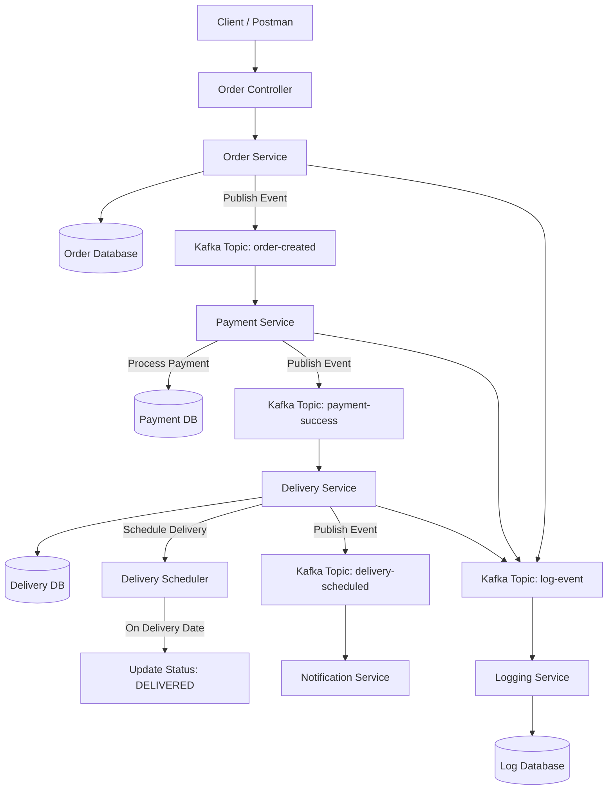
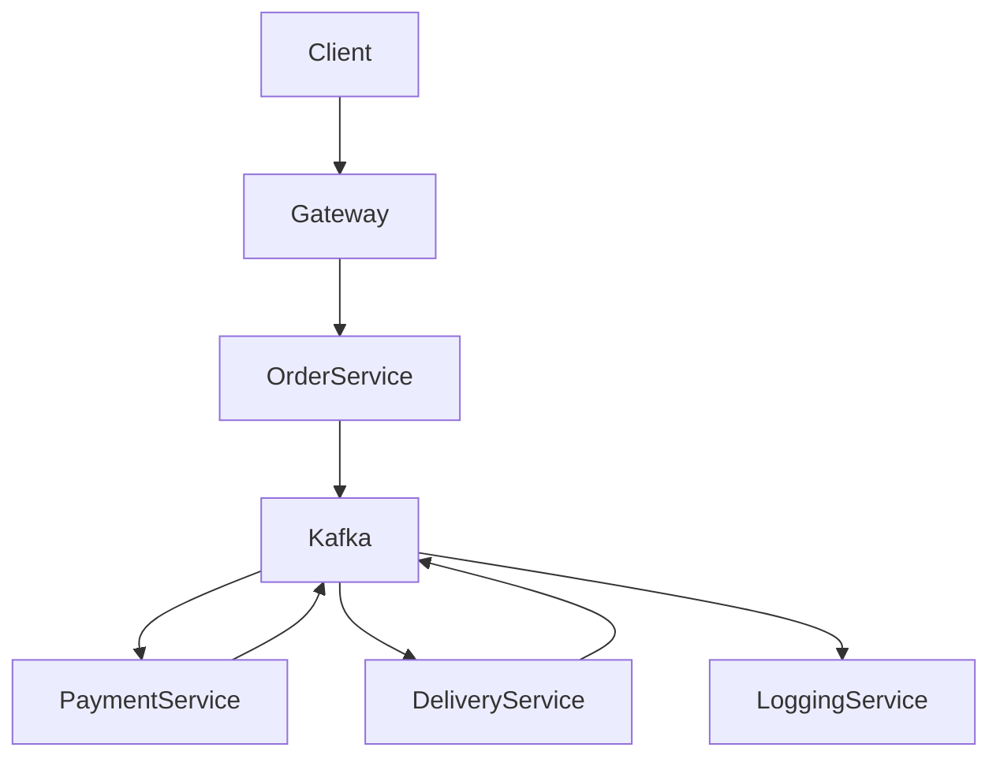

# E-Commerce application

# orderservice
For learning purpose, I am creating this Order Service for an event-driven e-commerce system using Spring Boot, Kafka, and JPA with REST APIs and transaction-based logging.


# 🛒 Order Service – E-Commerce Microservices

## Flow Diagram 
## 🔁 Order Processing Flow



## Simplified Flow Diagram



## 📌 Overview

Order Service is a core microservice in an event-driven e-commerce system. It handles order creation, retrieval, and status management while publishing events to Kafka for downstream services like Payment and Delivery.

---

## 🏗️ Architecture

* Microservice Architecture
* Event-Driven Design
* Asynchronous communication using Kafka

---

## ⚙️ Tech Stack

* Java
* Spring Boot (Spring Web)
* Spring Data JPA
* Apache Kafka
* Oracle Database
* Lombok

---

## 🔁 Workflow

1. Client sends request to create an order
2. Order is persisted in the database
3. Event `order-created` is published to Kafka
4. Downstream services consume the event:

    * Payment Service
    * Delivery Service

---

## 📡 API Endpoints

### Create Order

```
POST /api/orders
```

### Get Order by ID

```
GET /api/orders/{orderId}
```

### Get All Orders

```
GET /api/orders
```

### Update Order Status

```
PUT /api/orders/{orderId}/status?status=PAID
```

---

## 📦 Sample Request

```json
{
  "orderName": "iPhone 15",
  "customerId": "CUST123",
  "orderPrice": 75000
}
```

---

## 📤 Kafka Events

### order-created

Published after successful order creation.

```json
{
  "orderId": "ORD123",
  "status": "CREATED"
}
```

---

## 🗄️ Database Schema

### orderdetails

* order_id (PK)
* order_name
* customer_id
* order_price
* status
* created_at

---

## 🔐 Features

* RESTful APIs
* Event-driven communication
* Transaction ID-based logging (extendable)
* Clean layered architecture (Controller → Service → Repository)

---

## 🚀 Future Enhancements

* JWT Authentication
* API Gateway integration
* Distributed logging service
* Circuit breaker (Resilience4j)
* GraphQL layer (optional)

---

## 📌 Author Notes

This project is part of a larger microservices ecosystem including:

* Payment Service
* Delivery Service
* Notification Service
* Logging Service

---

## ▶️ How to Run

```bash
mvn clean install
mvn spring-boot:run
```

Ensure Kafka is running locally before starting the service.

---

## 📊 Learning Outcome

This service demonstrates:

* Microservice design
* Kafka event publishing
* JPA-based persistence
* Scalable backend architecture

